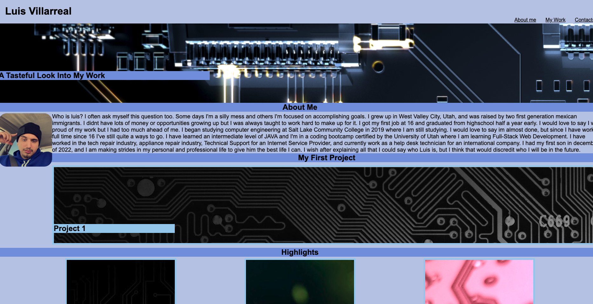

# Challenge 2

## Description

This project is my first draft of a portfolio website. We were tasked with some simple criteria. This webpage should accomplish the following:
1. Load my portfolio
2. Present name, photo, and functioning links to sections
3. Sections must be: About me, My Work, and Contact
4. First project must be displayed larger and must link to a deployment
5. Layout must adapt to viewport

    

## Installation

N/A for this site

## Usage

This site is used to view my portfolio

## Credits

N/A

## License

Refer to License in repo.